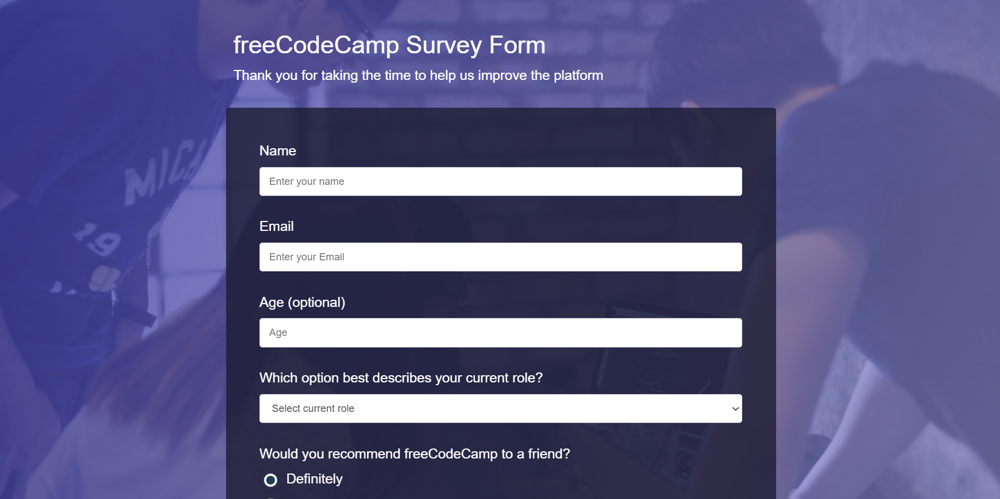

# Survey Form - Responsive Web Design Project 📝

This is the **Survey Form** project built as part of the [freeCodeCamp's Responsive Web Design Certification](https://www.freecodecamp.org/learn/). It is one of the five required projects for the certification.

## 🧾 Project Details

The form collects basic user information, preferences, and feedback about the platform. Built with **HTML5** and **CSS3**, it is fully responsive and meets the FCC's accessibility standards.

## 🎯 Features

- Responsive design
- Semantic HTML elements
- CSS custom properties
- Clean and accessible layout
- Form elements with validation
- Custom background using linear gradients and image overlay

## 🚀 Live Demo

👉 [View Live Project] [fccrwdsurveyform.netlify.app](https://fccrwdsurveyform.netlify.app)   
👉 [GitHub Repo](https://github.com/chauhandigvijay1/fcc-rwd-surveyform.git)

## 📂 Folder Structure
fcc-rwd-surveyform/

│

├── index.html # HTML structure

├── styles.css # Custom styling

├── screenshot.png # Project preview

└── README.md # Project details 

## 📸 Screenshot

## ✅ Built With

- HTML5
- CSS3 (Flexbox, Variables, Media Queries)

## 📜 License

This project is part of the [freeCodeCamp curriculum](https://www.freecodecamp.org/) and follows the guidelines of educational use.

## 🔗 Connect with Me
🧑‍💻 LinkedIn (www.linkedin.com/in/digvijaykumarsingh)

🐦 X (https://x.com/DigvijaySi29958)

📬 chauhandigvijay669@gmail.com

